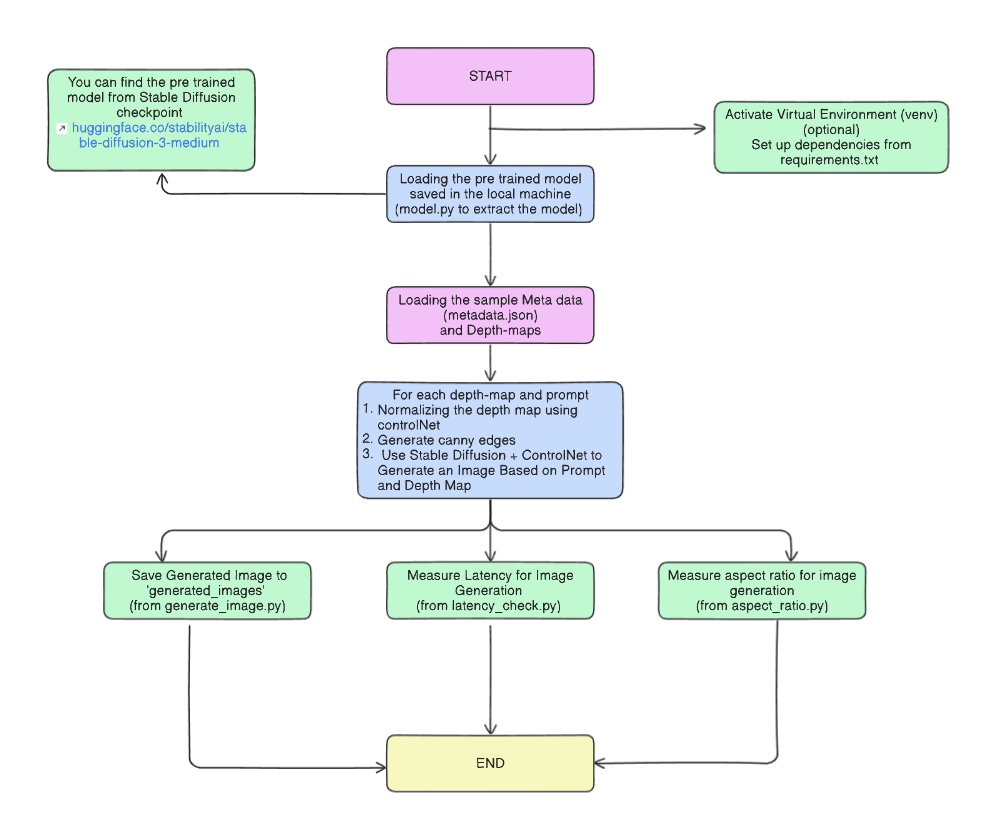

# Image Generation Using Stable Diffusion and Depth Maps

# **Introduction**
This project emphasis on using the Stable Diffusion model from Hugging face for generating artifical intelligence images based on prompts and depth-maps(these are the grayscale blueprints of images with respect to their prompts).
* It also encorporates measuring latency of the images which is the time taken for the image to be generated with the help of depth-maps and prompts (end time- start time).Latency helps us to measure that how our genAI model is performing and ensures higher computation accuracy.

* Assesing the aspect-ratio for the no-crop image which helps in adjusting the outliers and edge cases of the image.

## **Features**
* <u>**Text-to-Image Generation:**</u> Generate high-resolution images from prompts and depth maps.
* <u>**Latency Measurement:**</u> Measure time taken for image generation.
* <u>**Aspect Ratio Testing:**</u> Adjust and test different aspect ratios for images.
* <u>**Normalization and Depth Map Preprocessing:**</u> Loading and normalizing the canny edges of depth maps.

## **Project Workflow**

+ **Virtual Environment:**
This is an optional step but its advised to set up a virtual environment for seamless execution of the project.
+ **Requirements:**
Kindly install the necesssary requirements from [requirements](requirements.txt)
+ **Pre Trained Model:**
You can find the pre trained stable diffusion model from https://huggingface.co/stabilityai/stable-diffusion-3-medium
You can either download the model using [model download to local machine](model.py) or call the API. We need to create a pipeline with the help of torch and save on local machine.

+ **Normalisation of Depth Maps using Control Net:**
Normalisation of depth map is one of the essential pre processing step for adjusting all the edge and corner cases for the depth maps for easy image generation. The use of control net is a part of [generate_image.py](generate_image.py).
+ **Generating Images:**
After the normalisation of the depth maps we can match them by including a meta file consisting of all the prompts corresponding to the depth maps.
[metadata](metadata.json). The images will be stored in your project structure only.
+ **Aspect Ratio Check:**
To adjust the depth maps according to certain aspect ratio for equal ratio of images [aspect_ratio.py](aspect_ratio.py). I have done it manually for two ratio(16:9) and (1:1).
+ **Latency Check:** Latency is basically the time taken by the image to generate using the relevant depth maps and prompt. It will help in finding out the time taken by the depth maps to generate the relevant image [latency_check.py](latency_check.py).

## **Outputs**
Images generated are present in [generated_images](generated_images)

## **Observations**
The Observations, Advantages and Disadvantages are listed in [Report](<~$oject Report.docx>)

